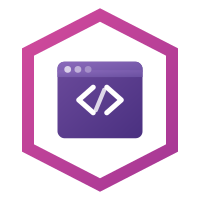

<p align="center"></p>

---

[](https://github.com/tetratelabs/built-on-envoy/actions/workflows/cli.yaml)
[](https://codecov.io/gh/tetratelabs/built-on-envoy)
[](https://github.com/tetratelabs/built-on-envoy/actions/workflows/extensions.yaml)
[](https://codecov.io/gh/tetratelabs/built-on-envoy)
[](LICENSE)
[](https://tetrate-community.slack.com/archives/C0AG8GLT41E)


> [!Note]
> Site password: https://linkly.link/2cgfR
>
> For **early access to Built On Envoy**, you'll have to configure the following
> environment variables, and to a `docker login` as follows because the GitHub repository is still private:
> ```
> export BOE_REGITRY_USERNAME=<your GitHub user>
> export BOE_REGISTRY_PASSWORD=<GitHub Personal Access Token>
>
> echo $BOE_REGISTRY_PASSWORD | docker login ghcr.io -u $BOE_REGITRY_USERNAME --password-stdin
> ```
> The GitHub PAT needs to have the `read:packages` scope. You can find more information on how to create your PAT
> [here](https://docs.github.com/en/authentication/keeping-your-account-and-data-secure/managing-your-personal-access-tokens?versionId=free-pro-team%40latest&productId=apps&restPage=oauth-apps%2Cbuilding-oauth-apps%2Cscopes-for-oauth-apps#creating-a-personal-access-token-classic).

A community-driven marketplace for Envoy Proxy extensions. Discover, run, and build custom filters with zero friction.

## Project Overview

**Built On Envoy** is designed to make extending [Envoy Proxy](https://www.envoyproxy.io/) as simple as possible. It consists of:

1. **Marketplace Repository**: A central place where the community can find and contribute extensions.
2. **CLI Tool (`boe`)**: A command-line tool for discovering, running, and building extensions.

## Quick Start

### Install the CLI

```shell
curl -sL https://builtonenvoy.io/install.sh | sh
```

Or build from source:

```shell
git clone https://github.com/tetratelabs/built-on-envoy
cd built-on-envoy/cli
make
```

### List Available Extensions

```bash
boe list
```

### Run an Extension

```bash
# Run a marketplace extension
boe run --extension example-go

# Run a local extension
boe run --local ./my-extension
```

### Generate Envoy Configuration

```bash
boe gen-config --extension example-go > envoy.yaml
```

## Contributing Extensions

1. Fork this repository.
2. Create a new directory under `extensions/` with your extension name.
3. Add a `manifest.yaml` file with the required metadata.
4. Add your extension code.
5. Open a pull request!

See the [Extension Guide](./extensions/) for more details.

## License

Apache 2.0 - See [LICENSE](LICENSE) for details.
