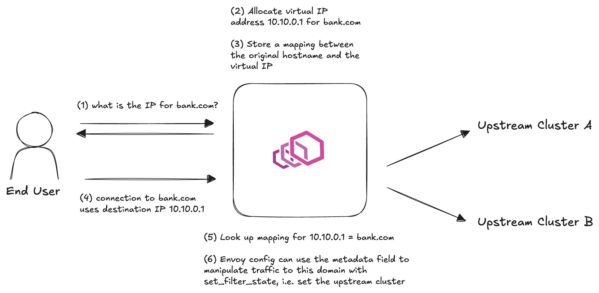

# DNS Gateway

Transparent egress routing for Envoy. Applications make normal DNS lookups and TCP connections
— this extension intercepts both so Envoy can control which upstream cluster handles each
domain, attach metadata (auth tokens, policy IDs), and enforce routing policy, all without
any application changes.

**Use cases:**
- Route outbound traffic through different upstream proxies based on destination domain
- Attach per-domain credentials or policy metadata to proxied connections
- Enforce egress access control by selectively intercepting DNS for specific domains



## Prerequisites

Requires iptables/nftables rules to redirect application traffic to Envoy:

- **DNS**: UDP port 53 redirected to Envoy's DNS listener (e.g. port 15053)
- **TCP**: Outbound connections to virtual IP ranges redirected to Envoy's TCP listener (e.g. port 15001)

## How it works

1. **`dns_gateway`** (UDP listener filter) — Intercepts DNS queries. If the queried domain matches
   a configured pattern, allocates a virtual IP from that domain's dedicated CIDR range and responds
   with an A record. Each domain pattern gets its own IP range, so `*.aws.com` and `*.google.com`
   allocate from separate subnets. Caches the mapping from virtual IP to domain and metadata.
   Non-matching queries pass through.

2. **`cache_lookup`** (network filter) — On new TCP connections, looks up the destination virtual IP
   in the shared cache and sets the resolved domain and metadata as Envoy
   [filter state](https://www.envoyproxy.io/docs/envoy/latest/intro/arch_overview/advanced/data_sharing_between_filters#primitives)
   for use in routing.

```
 Application
     |  DNS query: "bucket-1.aws.com"
     v
 dns_gateway
     |  matches "*.aws.com", allocates 10.239.0.0 from *.aws.com's range, responds with A record
     v
 Application
     |  TCP connect to 10.239.0.0:443
     v
 cache_lookup
     |  resolves 10.239.0.0 -> domain="bucket-1.aws.com", metadata.cluster="aws"
     v
 tcp_proxy
     |  routes to upstream cluster using filter state
     v
 External service (bucket-1.aws.com)
```

## Filter state

`cache_lookup` sets the following keys, accessible via `%FILTER_STATE(...)%`:

| Key                                | Example                          |
| ---------------------------------- | -------------------------------- |
| `envoy.dns_gateway.domain`         | `bucket-1.aws.com`               |
| `envoy.dns_gateway.metadata.<key>` | value from matched domain config |

Usage in Envoy config:

- `%FILTER_STATE(envoy.dns_gateway.domain:PLAIN)%`
- `%FILTER_STATE(envoy.dns_gateway.metadata.cluster:PLAIN)%`

## Domain matching

- **Exact**: `"example.com"` — matches only `example.com`
- **Wildcard**: `"*.aws.com"` — matches one subdomain level (e.g. `api.aws.com`) but not `aws.com` itself or nested subdomains like `sub.api.aws.com`

## Configuration

### `dns_gateway`

| Field                   | Type    | Description                                                        |
| ----------------------- | ------- | ------------------------------------------------------------------ |
| `domains`               | array   | Domain matchers, each with its own CIDR range                      |
| `domains[].domain`      | string  | Exact (`"example.com"`) or wildcard (`"*.example.com"`) pattern    |
| `domains[].base_ip`     | string  | Base IPv4 address for virtual IP allocation (e.g. `"10.239.0.0"`) |
| `domains[].prefix_len`  | integer | CIDR prefix length (1-32). A `/24` gives 256 IPs.                 |
| `domains[].metadata`    | object  | String key-value pairs exposed via filter state                    |

### `cache_lookup`

No configuration. Use `filter_config: {}`.

## Building

```bash
cargo build --release -p dns-gateway
```

The compiled library will be at `target/release/libdns_gateway.{so,dylib}`.
