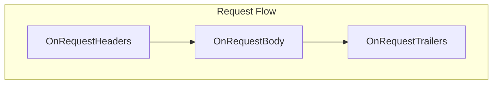
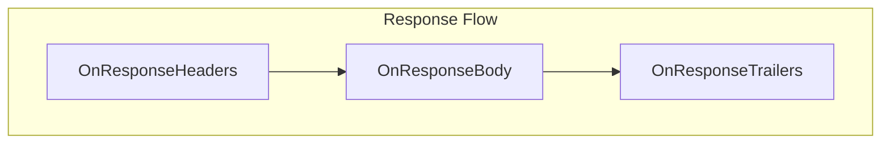

import ToC from '../../components/ToC.astro';

# Writing Go Extensions

This guide walks you through creating a Go extension for Built On Envoy.
Go extensions are HTTP filters that run inside Envoy and can inspect and modify requests and responses as they flow through the proxy.

<ToC maxDepth="4"/>

## Prerequisites

- Go 1.25.6 or later.
- The `boe` CLI installed ([Getting Started](/docs/getting-started))

## Quick Start

Create a new extension called `my-extension` in the `my-extension` directory with a single command:

```bash
boe create my-extension --path my-extension
```

This generates a ready-to-use extension with all required files:

```
my-extension/
├── plugin.go        # Your filter implementation
├── manifest.yaml    # Extension metadata
├── Makefile         # Build targets
└── go.mod           # Go module file
```

Build and test it:

```bash
boe run --local my-extension/
```

Test with curl:

```bash
curl -v http://localhost:10000/status/200
```

You should see your custom header `x-my-extension: example` in the response.

## Extension Structure

### The Filter Implementation

A Go extension implements uses the [Go SDK](https://github.com/envoyproxy/envoy/tree/main/source/extensions/dynamic_modules/sdk/go)
for the [Envoy Dynamic Modules](https://www.envoyproxy.io/docs/envoy/latest/intro/arch_overview/advanced/dynamic_modules).
The following example shows a minimal plugin and the main components that are needed:

```go
package main

import (
    "github.com/envoyproxy/envoy/source/extensions/dynamic_modules/sdk/go/shared"
)

// The HTTP filter that processes each request/response
type customHttpFilter struct {
    shared.EmptyHttpFilter
    handle shared.HttpFilterHandle
}

// Called when request headers arrive
func (f *customHttpFilter) OnRequestHeaders(headers shared.HeaderMap, endStream bool) shared.HeadersStatus {
    headers.Set("x-custom-header", "value")
    f.handle.Log(shared.LogLevelInfo, "Processing request")
    return shared.HeadersStatusContinue
}

// Called when response headers arrive
func (f *customHttpFilter) OnResponseHeaders(headers shared.HeaderMap, endStream bool) shared.HeadersStatus {
    return shared.HeadersStatusContinue
}

// Factory that creates filter instances
type customHttpFilterFactory struct{}

func (f *customHttpFilterFactory) Create(handle shared.HttpFilterHandle) shared.HttpFilter {
    return &customHttpFilter{handle: handle}
}

// Config factory - entry point for the extension
type customHttpFilterConfigFactory struct {
    shared.EmptyHttpFilterConfigFactory
}

func (f *customHttpFilterConfigFactory) Create(handle shared.HttpFilterConfigHandle, config []byte) (shared.HttpFilterFactory, error) {
    return &customHttpFilterFactory{}, nil
}

// Required entry point - maps extension name to its config factory
func WellKnownHttpFilterConfigFactories() map[string]shared.HttpFilterConfigFactory {
    return map[string]shared.HttpFilterConfigFactory{
        "my-extension": &customHttpFilterConfigFactory{},
    }
}
```

**Key components:**

| Component | Purpose |
|-----------|---------|
| `customHttpFilter` | Processes individual HTTP streams |
| `customHttpFilterFactory` | Creates filter instances for each stream |
| `customHttpFilterConfigFactory` | Parses configuration, creates factories |
| `WellKnownHttpFilterConfigFactories()` | Entry point that registers the extension |

### The Manifest

The manifest describes your extension:

```yaml
name: my-extension
version: 0.0.1
type: composer
composerVersion: 0.2.1
categories:
  - Security             # Or: Traffic, Observability, Examples, Misc
author: Your Name
description: Short description of what your extension does.
longDescription: |
  A longer description with details about features,
  use cases, and configuration options.
tags:
  - go
  - http
  - filter
license: Apache-2.0
examples:
  - title: Basic usage
    description: Run the extension
    code: |
      boe run --extension my-extension
```

**Important:** The `composerVersion` field must match the version of the Composer dynamic module that will load your plugin.
See the [version compatibility](#version-compatibility) section for more details.

## Filter Lifecycle

The filter receives callbacks at each stage of request/response processing:





### Callback Return Values

Each callback returns a status that controls processing. The following table shows the most commonly
used return values. For more details about the different return values, refer to the
[Dynamic Modules Go SDK](https://github.com/envoyproxy/envoy/tree/main/source/extensions/dynamic_modules/sdk/go).

| Return Value | Description |
| ------------ | ----------- |
| `HeadersStatusContinue` | Continue to the next filter in the chain |
| `HeadersStatusStop` | Stop processing headers and continue processing the request (body, trailers, etc) |
| `BodyStatusContinue` | Continue to the next filter in the chain |
| `BodyStatusStopAndBuffer` | Stop processing the body and buffer the data |
| `TrailersStatusContinue` | Continue to the next filter in the chain |

## Common Operations

### Working with Headers

```go
func (f *customHttpFilter) OnRequestHeaders(headers shared.HeaderMap, endStream bool) shared.HeadersStatus {
    // Get a header
    host := headers.GetOne("host")

    // Get all headers
    allHeaders := headers.GetAll()

    // Set a header (overwrites if exists)
    headers.Set("x-custom", "value")

    // Remove a header
    headers.Remove("x-unwanted")

    return shared.HeadersStatusContinue
}
```

### Modifying the Request Body

To modify the body, you need to buffer it first by returning `HeadersStatusStop` from `OnRequestHeaders`:

```go
func (f *customHttpFilter) OnRequestHeaders(headers shared.HeaderMap, endStream bool) shared.HeadersStatus {
    if !endStream {
        return shared.HeadersStatusStop // Wait for body
    }
    return shared.HeadersStatusContinue
}

func (f *customHttpFilter) OnRequestBody(body shared.BodyBuffer, endStream bool) shared.BodyStatus {
    if !endStream {
        return shared.BodyStatusStopAndBuffer // Keep buffering
    }

    // Get the complete buffered body
    bufferedBody := f.handle.BufferedRequestBody()

    // Read original content
    var original []byte
    for _, chunk := range bufferedBody.GetChunks() {
        original = append(original, chunk...)
    }

    // Replace with new content
    bufferedBody.Drain(bufferedBody.GetSize())
    bufferedBody.Append([]byte("Modified body"))

    // Update content-length header
    f.handle.RequestHeaders().Remove("content-length")

    return shared.BodyStatusContinue
}
```

### Sending a Local Response

You can short-circuit the request and return a response directly:

```go
func (f *customHttpFilter) OnRequestHeaders(headers shared.HeaderMap, endStream bool) shared.HeadersStatus {
    if headers.GetOne("x-block") == "true" {
        f.handle.SendLocalResponse(
            403,                                    // Status code
            nil,                                    // Headers (optional)
            []byte("Access denied"),                // Body
            "my-extension",                         // Detail
        )
        return shared.HeadersStatusStop
    }
    return shared.HeadersStatusContinue
}
```

### Accessing Request Attributes

```go
func (f *customHttpFilter) OnRequestHeaders(headers shared.HeaderMap, endStream bool) shared.HeadersStatus {
    host, _ := f.handle.GetAttributeString(shared.AttributeIDRequestHost)
    f.handle.Log(shared.LogLevelInfo, "Request host: %s", host)
    return shared.HeadersStatusContinue
}
```

### Working with Metadata

Store and retrieve dynamic metadata:

```go
// Set metadata
f.handle.SetMetadata("my-namespace", "key", "value")
f.handle.SetMetadata("my-namespace", "count", int64(42))

// Get metadata
strValue, _ := f.handle.GetMetadataString(shared.MetadataSourceTypeDynamic, "my-namespace", "key")
numValue, _ := f.handle.GetMetadataNumber(shared.MetadataSourceTypeDynamic, "my-namespace", "count")
```

### Logging

```go
f.handle.Log(shared.LogLevelDebug, "Debug message: %s", value)
f.handle.Log(shared.LogLevelInfo, "Info message")
f.handle.Log(shared.LogLevelWarn, "Warning: %d items", count)
f.handle.Log(shared.LogLevelError, "Error: %v", err)
```

### Defining Metrics

Define metrics in the config factory, use them in the filter:

```go
type customHttpFilterFactory struct {
    counter   shared.MetricID
    hasCounter bool
}

func (f *customHttpFilterConfigFactory) Create(handle shared.HttpFilterConfigHandle, config []byte) (shared.HttpFilterFactory, error) {
    factory := &customHttpFilterFactory{}

    // Define a counter
    counter, status := handle.DefineCounter("my_extension_requests")
    if status == shared.MetricsSuccess {
        factory.counter = counter
        factory.hasCounter = true
    }

    // Define a counter with tags
    taggedCounter, _ := handle.DefineCounter("my_extension_requests_by_path", "path")

    // Define a gauge
    gauge, _ := handle.DefineGauge("my_extension_active")

    // Define a histogram
    histogram, _ := handle.DefineHistogram("my_extension_latency")

    return factory, nil
}

// In the filter:
func (f *customHttpFilter) OnRequestHeaders(headers shared.HeaderMap, endStream bool) shared.HeadersStatus {
    if f.factory.hasCounter {
        f.handle.IncrementCounterValue(f.factory.counter, 1)
    }
    return shared.HeadersStatusContinue
}
```

## Building and Testing

### Build Commands

```bash
# Build the plugin
make build

# Install to local boe data directory
make install

# Clean build artifacts
make clean
```

### Running Locally

During development, run your extension directly from the source directory:

```bash
boe run --local my-extension/
```

This is faster than installing because it doesn't require copying files.

### Viewing Logs

Enable debug logging to see your filter's log messages:

```bash
boe run --local my-extension/ --log-level all:debug
```

Or for just your extension's logs:

```bash
boe run --local my-extension/ --log-level dynamic_modules:debug
```

### Testing with curl

By default, `boe run` will start Envoy and proxy https://httpbin.org, so you can use `curl` to send any request
and verify the headers, return codes, etc.

```bash
# Basic request
curl http://localhost:10000/status/200

# With verbose output to see headers
curl -v http://localhost:10000/status/200

# POST with body
curl -X POST -d '{"test": "data"}' http://localhost:10000/status/200

# With custom header
curl -H "x-custom: value" http://localhost:10000/status/200
```

## Version Compatibility

Go plugins have strict version requirements. See the [example-go](https://github.com/tetratelabs/built-on-envoy/tree/main/extensions/example-go/)
README file in GitHub for further details about version compatibility and how the internals work.

The `composerVersion` in your manifest indicates which Composer version your plugin is compatible with.
When the Composer loads your plugin, it validates these requirements.

## Complete Example

For a complete example, refer to the [example-go](https://github.com/tetratelabs/built-on-envoy/tree/main/extensions/example-go/) extension in GitHub.

## Next Steps

- Browse the [Extensions Catalog](/extensions) for more examples
- Check the [Extension Manifest Reference](/docs/reference/manifest) for all manifest options
- See the [CLI Commands](/docs/cli/run) for more runtime options
