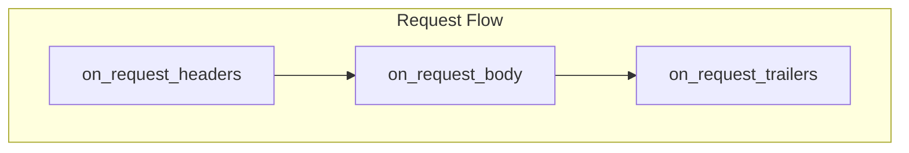
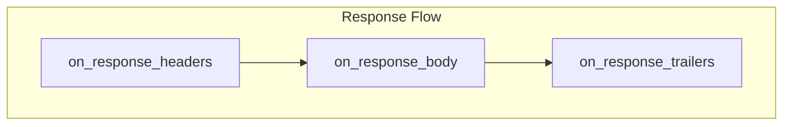

import ToC from '../../components/ToC.astro';

# Writing Rust Extensions

This guide walks you through creating a Rust extension for Built On Envoy.
Rust extensions are HTTP filters compiled as native dynamic modules that Envoy loads directly, with no intermediate runtime or plugin loader.

<ToC maxDepth="4"/>

## Prerequisites

Refer to the [Running Local Extensions](/docs/running-local-extensions) page for the details about the build prerequisites.

## Quick Start

Create a new extension called `my-extension` in the `my-extension` directory with a single command:

```bash
boe create my-extension --type dynamic_module_rust --path my-extension
```

This generates a ready-to-use extension with all required files. You can build and test it with:

```bash
boe run --local my-extension/
```

Test with curl:

```bash
curl -v http://localhost:10000/status/200
```

You should see your custom header `x-my-extension: example` in the response.

## Extension Structure

### The Filter Implementation

A Rust extension uses the [Rust SDK](https://github.com/envoyproxy/envoy/tree/main/source/extensions/dynamic_modules/sdk/rust)
for the [Envoy Dynamic Modules](https://www.envoyproxy.io/docs/envoy/latest/intro/arch_overview/advanced/dynamic_modules).
The following example shows a minimal filter and the main components that are needed:

```rust
use envoy_proxy_dynamic_modules_rust_sdk::*;

// Parsed configuration shared across all filter instances
#[derive(Debug, Clone)]
pub struct FilterConfig {
    header_value: String,
}

impl FilterConfig {
    pub fn new(filter_config: &str) -> Option<Self> {
        Some(FilterConfig {
            header_value: if filter_config.is_empty() {
                "example".to_string()
            } else {
                filter_config.to_string()
            },
        })
    }
}

// Creates a new filter instance for each HTTP stream
impl<EHF: EnvoyHttpFilter> HttpFilterConfig<EHF> for FilterConfig {
    fn new_http_filter(&self, _envoy: &mut EHF) -> Box<dyn HttpFilter<EHF>> {
        Box::new(Filter {
            filter_config: self.clone(),
        })
    }
}

// The HTTP filter that processes each request/response
pub struct Filter {
    filter_config: FilterConfig,
}

impl<EHF: EnvoyHttpFilter> HttpFilter<EHF> for Filter {
    fn on_request_headers(
        &mut self,
        envoy_filter: &mut EHF,
        _end_stream: bool,
    ) -> abi::envoy_dynamic_module_type_on_http_filter_request_headers_status {
        envoy_filter.set_request_header("x-custom", self.filter_config.header_value.as_bytes());
        envoy_log_info!("Processing request");
        abi::envoy_dynamic_module_type_on_http_filter_request_headers_status::Continue
    }

    fn on_response_headers(
        &mut self,
        _envoy_filter: &mut EHF,
        _end_stream: bool,
    ) -> abi::envoy_dynamic_module_type_on_http_filter_response_headers_status {
        abi::envoy_dynamic_module_type_on_http_filter_response_headers_status::Continue
    }
}

// Module initialization
fn init() -> bool { true }

// Maps filter names to their config factories
fn new_http_filter_config_fn<EC: EnvoyHttpFilterConfig, EHF: EnvoyHttpFilter>(
    _envoy_filter_config: &mut EC,
    filter_name: &str,
    filter_config: &[u8],
) -> Option<Box<dyn HttpFilterConfig<EHF>>> {
    let config_str = std::str::from_utf8(filter_config).unwrap_or("");
    match filter_name {
        "my-extension" => FilterConfig::new(config_str)
            .map(|c| Box::new(c) as Box<dyn HttpFilterConfig<EHF>>),
        _ => panic!("Unknown filter name: {filter_name}"),
    }
}

// Required entry point macro
declare_init_functions!(init, new_http_filter_config_fn);
```

**Key components:**

| Component | Purpose |
|-----------|---------|
| `FilterConfig` | Parses configuration, creates filter instances via `HttpFilterConfig` |
| `Filter` | Processes individual HTTP streams via `HttpFilter` |
| `new_http_filter_config_fn` | Maps extension names to their config factories |
| `declare_init_functions!` | Wires up the entry points that Envoy expects |

### The Cargo Configuration

The `Cargo.toml` must declare the crate as a `cdylib` so it compiles to a C-compatible shared library:

```toml
[package]
name = "my-extension"
version = "0.1.0"
edition = "2021"

[dependencies]
envoy-proxy-dynamic-modules-rust-sdk = { git = "https://github.com/envoyproxy/envoy", rev = "..." }
serde = { version = "1.0", features = ["derive"] }
serde_json = "1.0"

[lib]
name = "my_extension"
path = "src/lib.rs"
crate-type = ["cdylib"]
```

> **Note:** The `[lib] name` must use underscores (Rust convention), even if the extension name uses hyphens.
> For example, an extension named `my-extension` should have `name = "my_extension"`.

### The Manifest

The manifest describes your extension:

```yaml
name: my-extension
version: 0.1.0
type: dynamic_module
categories:
  - Security             # Or: Traffic, Observability, Examples, Misc
author: Your Name
description: Short description of what your extension does.
longDescription: |
  A longer description with details about features,
  use cases, and configuration options.
tags:
  - rust
  - dynamic-module
  - http
  - filter
license: Apache-2.0
examples:
  - title: Basic usage
    description: Run the extension
    code: |
      boe run --extension my-extension
```

## Filter Lifecycle

The filter receives callbacks at each stage of request/response processing:





After both flows complete, `on_stream_complete` is called before the filter is dropped.

### Callback Return Values

Each callback returns a status enum that controls processing. The following table shows the most commonly
used return values. For more details, refer to the
[Dynamic Modules Rust SDK](https://github.com/envoyproxy/envoy/tree/main/source/extensions/dynamic_modules/sdk/rust).

| Return Value | Description |
| ------------ | ----------- |
| `Continue` | Continue to the next filter in the chain |
| `StopIteration` | Stop processing and pause the filter chain |

These are namespaced per callback. For example, the request headers callback returns
`abi::envoy_dynamic_module_type_on_http_filter_request_headers_status::Continue`.

## Common Operations

### Working with Headers

```rust
fn on_request_headers(
    &mut self,
    envoy_filter: &mut EHF,
    _end_stream: bool,
) -> abi::envoy_dynamic_module_type_on_http_filter_request_headers_status {
    // Get a header value
    if let Some(host) = envoy_filter.get_request_header_value("host") {
        envoy_log_info!("Host: {:?}", host.as_slice());
    }

    // Get all values for a header (e.g. multi-value headers)
    let values = envoy_filter.get_request_header_values("x-forwarded-for");

    // Get all headers as key-value pairs
    let all_headers = envoy_filter.get_request_headers();

    // Set a header (overwrites if exists)
    envoy_filter.set_request_header("x-custom", b"value");

    // Add a header (preserves existing values)
    envoy_filter.add_request_header("x-multi", b"value1");

    // Remove a header
    envoy_filter.remove_request_header("x-unwanted");

    abi::envoy_dynamic_module_type_on_http_filter_request_headers_status::Continue
}
```

Response headers work the same way with the corresponding methods:
`get_response_header_value`, `set_response_header`, `add_response_header`, and `remove_response_header`.

### Modifying the Request Body

To modify the body, stop iteration in `on_request_headers` and process the body in `on_request_body`:

```rust
fn on_request_headers(
    &mut self,
    _envoy_filter: &mut EHF,
    end_stream: bool,
) -> abi::envoy_dynamic_module_type_on_http_filter_request_headers_status {
    if !end_stream {
        // Stop iteration to wait for the body
        return abi::envoy_dynamic_module_type_on_http_filter_request_headers_status::StopIteration;
    }
    abi::envoy_dynamic_module_type_on_http_filter_request_headers_status::Continue
}

fn on_request_body(
    &mut self,
    envoy_filter: &mut EHF,
    end_stream: bool,
) -> abi::envoy_dynamic_module_type_on_http_filter_request_body_status {
    if !end_stream {
        // Keep buffering until the full body arrives
        return abi::envoy_dynamic_module_type_on_http_filter_request_body_status::StopIterationAndBuffer;
    }

    // Read the buffered body
    if let Some(buffers) = envoy_filter.get_buffered_request_body() {
        let mut original = Vec::new();
        for buf in &buffers {
            original.extend_from_slice(buf.as_slice());
        }

        // Replace with new content: drain first, then append
        let size = envoy_filter.get_buffered_request_body_size();
        envoy_filter.drain_buffered_request_body(size);
        envoy_filter.append_buffered_request_body(b"Modified body");

        // Remember to update content-length if needed
        envoy_filter.remove_request_header("content-length");
    }

    abi::envoy_dynamic_module_type_on_http_filter_request_body_status::Continue
}
```

### Sending a Local Response

You can short-circuit the request and return a response directly:

```rust
fn on_request_headers(
    &mut self,
    envoy_filter: &mut EHF,
    _end_stream: bool,
) -> abi::envoy_dynamic_module_type_on_http_filter_request_headers_status {
    if let Some(val) = envoy_filter.get_request_header_value("x-block") {
        if val.as_slice() == b"true" {
            envoy_filter.send_response(
                403,                               // Status code
                vec![("x-reason", b"blocked")],    // Extra headers
                Some(b"Access denied"),             // Body
                Some("my-extension"),              // Detail for logs
            );
            return abi::envoy_dynamic_module_type_on_http_filter_request_headers_status::StopIteration;
        }
    }
    abi::envoy_dynamic_module_type_on_http_filter_request_headers_status::Continue
}
```

### Accessing Request Attributes

```rust
fn on_request_headers(
    &mut self,
    envoy_filter: &mut EHF,
    _end_stream: bool,
) -> abi::envoy_dynamic_module_type_on_http_filter_request_headers_status {
    // Get the source address as a string
    if let Some(addr) = envoy_filter.get_attribute_string(
        abi::envoy_dynamic_module_type_attribute_id::SourceAddress,
    ) {
        envoy_log_info!("Source address: {:?}", addr.as_slice());
    }

    // Get the source port as an integer
    if let Some(port) = envoy_filter.get_attribute_int(
        abi::envoy_dynamic_module_type_attribute_id::SourcePort,
    ) {
        envoy_log_info!("Source port: {}", port);
    }

    abi::envoy_dynamic_module_type_on_http_filter_request_headers_status::Continue
}
```

### Working with Metadata

Store and retrieve dynamic metadata:

```rust
// Set dynamic metadata
envoy_filter.set_dynamic_metadata_string("my-namespace", "key", "value");
envoy_filter.set_dynamic_metadata_number("my-namespace", "count", 42.0);

// Get metadata
if let Some(val) = envoy_filter.get_metadata_string(
    abi::envoy_dynamic_module_type_metadata_source::Dynamic,
    "my-namespace",
    "key",
) {
    envoy_log_info!("Metadata value: {:?}", val.as_slice());
}

if let Some(num) = envoy_filter.get_metadata_number(
    abi::envoy_dynamic_module_type_metadata_source::Dynamic,
    "my-namespace",
    "count",
) {
    envoy_log_info!("Metadata count: {}", num);
}
```

### Logging

The SDK provides macros that integrate with Envoy's logging system. Messages are only allocated
if the log level is enabled on the Envoy side.

```rust
envoy_log_trace!("Trace message: {}", value);
envoy_log_debug!("Debug message: {}", value);
envoy_log_info!("Info message");
envoy_log_warn!("Warning: {} items", count);
envoy_log_error!("Error: {}", err);
envoy_log_critical!("Critical failure");
```

### Defining Metrics

Define metrics in the config factory (`new_http_filter_config_fn`), store the IDs in your `FilterConfig`,
and use them in the filter:

```rust
use std::sync::Arc;

#[derive(Debug, Clone)]
pub struct FilterConfig {
    counter: Option<EnvoyCounterId>,
    gauge: Option<EnvoyGaugeId>,
    histogram: Option<EnvoyHistogramId>,
}

fn new_http_filter_config_fn<EC: EnvoyHttpFilterConfig, EHF: EnvoyHttpFilter>(
    envoy_filter_config: &mut EC,
    filter_name: &str,
    _filter_config: &[u8],
) -> Option<Box<dyn HttpFilterConfig<EHF>>> {
    match filter_name {
        "my-extension" => {
            // Define metrics
            let counter = envoy_filter_config.define_counter("my_extension_requests").ok();
            let gauge = envoy_filter_config.define_gauge("my_extension_active").ok();
            let histogram = envoy_filter_config.define_histogram("my_extension_latency").ok();

            Some(Box::new(FilterConfig { counter, gauge, histogram }))
        }
        _ => None,
    }
}

// In the filter:
fn on_request_headers(
    &mut self,
    envoy_filter: &mut EHF,
    _end_stream: bool,
) -> abi::envoy_dynamic_module_type_on_http_filter_request_headers_status {
    // Increment a counter
    if let Some(counter) = self.filter_config.counter {
        let _ = envoy_filter.increment_counter(counter, 1);
    }

    // Set a gauge value
    if let Some(gauge) = self.filter_config.gauge {
        let _ = envoy_filter.set_gauge(gauge, 1);
    }

    // Record a histogram value
    if let Some(histogram) = self.filter_config.histogram {
        let _ = envoy_filter.record_histogram_value(histogram, 42);
    }

    abi::envoy_dynamic_module_type_on_http_filter_request_headers_status::Continue
}
```

### Parsing JSON Configuration

Use `serde` and `serde_json` to parse JSON configuration passed via the `--config` flag:

```rust
use serde::{Deserialize, Serialize};

#[derive(Serialize, Deserialize, Debug)]
pub struct RawFilterConfig {
    #[serde(default = "default_header_value")]
    header_value: String,
}

fn default_header_value() -> String {
    "example".to_string()
}

impl FilterConfig {
    pub fn new(filter_config: &str) -> Option<Self> {
        let config: RawFilterConfig = if filter_config.is_empty() {
            RawFilterConfig { header_value: default_header_value() }
        } else {
            match serde_json::from_str(filter_config) {
                Ok(cfg) => cfg,
                Err(err) => {
                    envoy_log_error!("Error parsing filter config: {err}");
                    return None;
                }
            }
        };

        Some(FilterConfig {
            header_value: config.header_value,
        })
    }
}
```

Then pass configuration at runtime:

```bash
boe run --local my-extension/ --config '{"header_value": "custom-value"}'
```

## Building and Testing

### Build Commands

```bash
# Build the extension (release mode)
cargo build --release

# Run unit tests
cargo test
```

### Running Locally

During development, run your extension directly from the source directory:

```bash
boe run --local my-extension/
```

The CLI runs `cargo build --release` automatically and copies the resulting shared library to the local cache.

### Viewing Logs

Enable debug logging to see your filter's log messages:

```bash
boe run --local my-extension/ --log-level all:debug
```

Or for just your extension's logs:

```bash
boe run --local my-extension/ --log-level dynamic_modules:debug
```

### Testing with curl

By default, `boe run` will start Envoy and proxy https://httpbin.org, so you can use `curl` to send any request
and verify the headers, return codes, etc.

```bash
# Basic request
curl http://localhost:10000/status/200

# With verbose output to see headers
curl -v http://localhost:10000/status/200

# POST with body
curl -X POST -d '{"test": "data"}' http://localhost:10000/status/200

# With custom header
curl -H "x-custom: value" http://localhost:10000/status/200
```

### Unit Testing with Mocks

The SDK provides a `MockEnvoyHttpFilter` that you can use to unit test your filter logic without running Envoy:

```rust
#[cfg(test)]
mod tests {
    use super::*;

    #[test]
    fn test_request_blocked() {
        let filter_config = FilterConfig::new("").unwrap();
        let mut filter = Filter { filter_config };

        let mut mock = MockEnvoyHttpFilter::new();

        // Mock the header lookup
        mock.expect_get_request_header_value()
            .returning(|key| {
                if key == "x-block" {
                    Some(EnvoyBuffer::new("true"))
                } else {
                    None
                }
            });

        // Expect a 403 response to be sent
        mock.expect_send_response()
            .times(1)
            .returning(|code, _, _, _| assert_eq!(code, 403));

        let status = filter.on_request_headers(&mut mock, true);
        assert_eq!(
            status,
            abi::envoy_dynamic_module_type_on_http_filter_request_headers_status::StopIteration,
        );
    }
}
```

## Complete Example

For a complete example, refer to the [ip-restriction](https://github.com/tetratelabs/built-on-envoy/tree/main/extensions/ip-restriction) extension in GitHub.

## Next Steps

- Browse the [Extensions Catalog](/extensions) for more examples
- Check the [Extension Manifest Reference](/docs/reference/manifest) for all manifest options
- See the [CLI Commands](/docs/cli/run) for more runtime options
